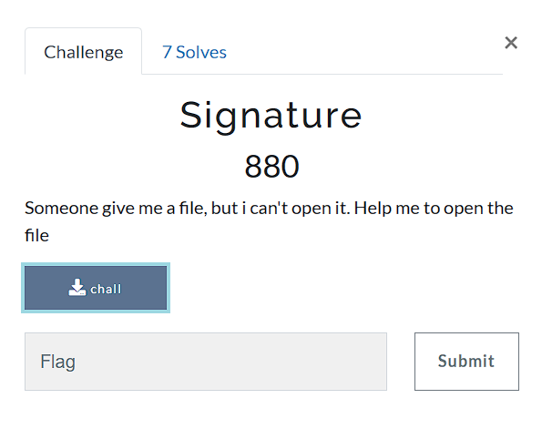

# Signature

## About the Challenge
Diberikan sebuah file dengan nama chall, kita diminta untuk membuka file tersebut.



## Solution
- Saya mencoba mencari kata kunci yaitu "ctf signature file" dan saya menemukan sebuah situs yang membahas tentang itu.
- Lalu saya melihat bahwa signature file image jpeg dan juga diberikan header hex penanda dia adalah jpeg.

- setelah tau bahwa file itu jpeg saya menambahkan ekstensi .jpeg pada file 'chall'
- Selanjutnya saya membuka hex editor online [url : https://hexed.it/] dan mengubah header hex dari file chall.jpeg dan di export.
 
- Hasilnya file image dapat dibuka dan flag ditemukan.
 

```
Flag : ForestyCTF{ezzzz123!!!}
```
